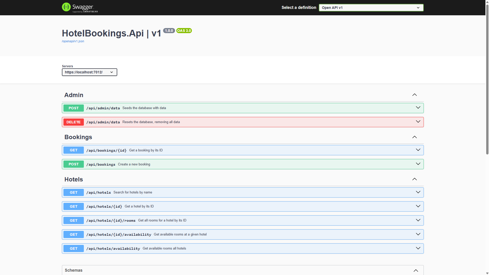
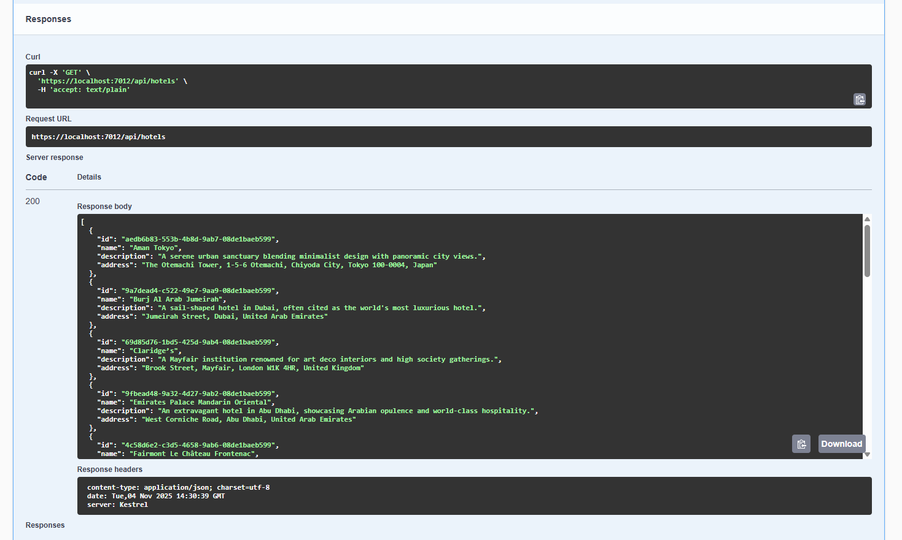

# Hotel Booking API
#### A repository for a hotel information and booking API with RESTFul endpoints, in a clean architecture implementation
---
### Live Demo
The various endpoints of the API are available to test via Swagger UI, on a version of the API deployed to Azure:
<a href="https://hotel-booking-fpd7afdaf4gnctgz.uksouth-01.azurewebsites.net/swagger/index.html">**Test via Swagger UI**</a>


### Running Locally
* Clone the repository to a convenient location, e.g. open a command prompt, navigate to the folder you wish to clone the repo to and run the following command:
```
git clone https://github.com/c-mc/waracle-hotel-booking.git
```
* Open the solution in Visual Studio, open Solution Explorer, right click on the `HotelBookings.Api` project and select `Set as Startup Project`

* Create a SQL database for use with the solution, e.g. <a href="https://learn.microsoft.com/en-us/azure/azure-sql/database/azure-sql-dotnet-quickstart?view=azuresql&tabs=visual-studio%2Cpasswordless%2Cservice-connector%2Cportal">Connect to and query Azure SQL Database using .NET</a>

* Update the connection string in ` \HotelBookings.Api\appsettings.Development.json` with your database connection details

* Open a command prompt and navigate to the `\HotelBookings.Api` directory

* In the command prompt, create the initial migration by running the following command:
```
dotnet ef migrations add InitialCreate
```
* In the command prompt, setup the database elements by running the following:
```
dotnet ef database update
```

* You can now run the solution by either pressing `F5` with the solution open in Visual Studio or by opening a command prompt, navigate to the `\HotelBookings.Api` directory and run:
```
dotnet run
```
 
* Once the solution has built and launched the Swagger UI is available at: <a href="https://localhost:7012/swagger/index.html">https://localhost:7012/swagger/index.html</a>




* Initially the database will be empty, calling the **POST** `/api/admin/data` endpoint will populate the hotels and rooms, so they can be booked and queried.

* Once the database is populated, calling the **GET** `/api/hotels` endpoint will return all of the hotels:



* To clear the data and reset the database, calling the **DELETE** `/api/admin/data` endpoint
